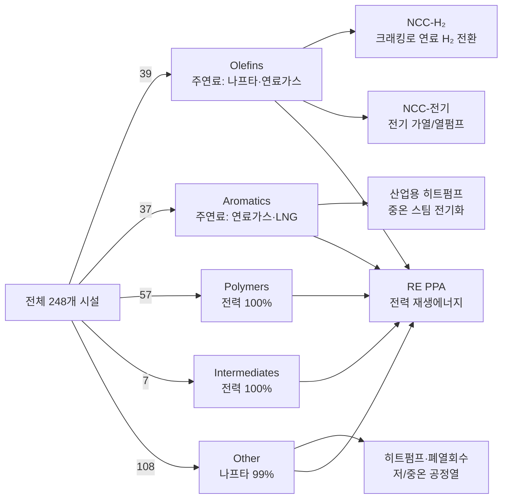

# 시설별 연료-기술 매핑 개요 (2025 기준)

본 문서는 `outputs/module_01/baseline_2025_detailed.csv`를 기반으로 248개 석유화학 시설의 에너지 사용 구조와 해당 모델에서 적용되는 탈탄소 기술을 정리한 것입니다. 2025년 기준 배출량(총 52 MtCO₂)과 에너지 믹스를 제품군 단위로 집계했으며, 모듈 2(MACC)에서 적용되는 기술별 전환 경로를 함께 도식화했습니다.

## 1. 제품군별 요약

| 제품군 | 시설 수 | 2025 배출량 (MtCO₂) | 주요 연료 구성 |
| --- | ---: | ---: | --- |
| Olefins | 39 | 46.3 | 나프타 71.5%, 연료가스 14.1%, LNG 11.0%, 부산물가스 3.1%, 전력 0.4% |
| Aromatics | 37 | 5.1 | 연료가스 48.7%, LNG 39.0%, 부산물가스 9.7%, 전력 2.5% |
| Other | 108 | 0.5 | 나프타 98.6%, 전력 1.4% |
| Polymers | 57 | 0.1 | 전력 100% |
| Intermediates | 7 | <0.1 | 전력 100% |

> **참고:** Olefins 그룹이 전체 배출량의 약 89%를 차지하며, 나프타 및 연료가스 중심의 연소 공정이 배출의 핵심입니다. Polymers/Intermediates는 전력 의존도가 높아 전력 탈탄소 전략이 곧 배출 감축 전략입니다.

## 2. 탈탄소 기술 매핑

아래 도식은 현행 모델에서 각 제품군이 어느 기술을 통해 탈탄소되는지를 보여줍니다. 동일 기술로 묶인 노드들은 모듈 2(MACC)에서 하나의 기술 비용 곡선을 공유합니다.

### 기술별 적용 범위

- **NCC-H₂ / NCC-전기**  
  - 대상: Naphtha Cracker(총 41개 시설, 대부분 Olefins)  
  - 내용: 크래킹로 연소 연료를 수소로 전환하거나 전기 가열로 대체. 나프타는 여전히 원료(feedstock)로 사용되지만, 연소 과정 배출을 제거.

- **산업용 히트펌프**  
  - 대상: Aromatics 및 기타(Other) 그룹의 중온 스팀/열 사용 설비  
  - 내용: 연료가스·LNG로 생산하던 공정열을 전기식 히트펌프로 대체. 필요 시 폐열회수(WHR)와 병행.

- **RE PPA (재생에너지 전력 구매)**  
  - 대상: 전 제품군의 전력 부하  
  - 내용: Polymers·Intermediates는 전력 100%라 RE PPA 전환만으로도 배출 제거. Olefins/Aromatics/Other 그룹도 보조 전력 수요를 RE로 전환하여 잔여 배출을 최소화.

## 3. 모델 상 고려사항

1. **나프타는 “연료”가 아니라 “원료”**  
   - Olefins 및 Other 그룹의 나프타 사용량이 매우 크지만, 모델에서는 연소 연료가 아닌 feedstock으로 간주합니다. MACC 기술은 연소부 배출을 처리하며, 원료 전환은 별도 연구 과제로 남아 있습니다.

2. **전력 탈탄소 = RE PPA**  
   - Polymers/Intermediates는 전력 의존도가 절대적이므로, RE PPA 비용곡선이 곧 해당 제품군의 MACC 곡선이 됩니다.

3. **히트펌프의 적용 한계**  
   - Aromatics/Other 그룹은 다양한 열수준이 혼재되어 있어, 히트펌프 적용이 가능한 공정(저~중온)과 그렇지 않은 공정을 구분해야 합니다. 모델은 기술 적용률(heat pump applicability)을 통해 현실적 한계를 반영합니다.

4. **잔여 배출 추적**  
   - NCC-H₂/전기 전환 이후에도 공정별로 잔여 전력 배출이 존재하므로, RE PPA 시나리오와 조합하여 최종 배출량을 산정합니다.

## 4. 향후 시각화 확장 아이디어

- **시설 단위 Sankey**: 제품군 → 연료 → 기술 흐름을 톤 단위로 시각화  
- **지역별 매핑**: `location` 정보를 활용한 GIS 레이어 제작  
- **온실가스 버블차트**: 시설별 배출량과 적용 기술을 동시에 표시  
- **전환 로드맵 타임라인**: 모듈 3(최적화) 결과와 연동하여 연도별 전환 스케줄 표현

필요 시 위 자료를 토대로 Streamlit 대시보드나 LaTeX 논문용 도식에 바로 활용할 수 있습니다.
