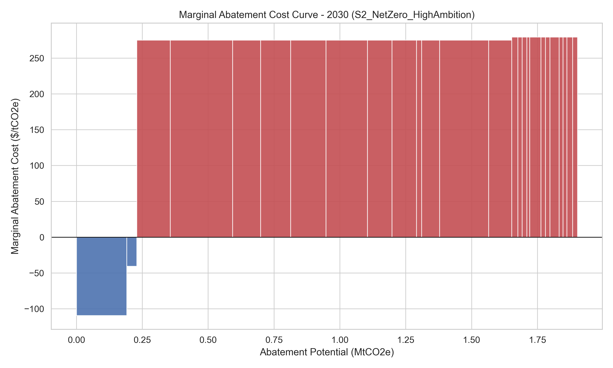
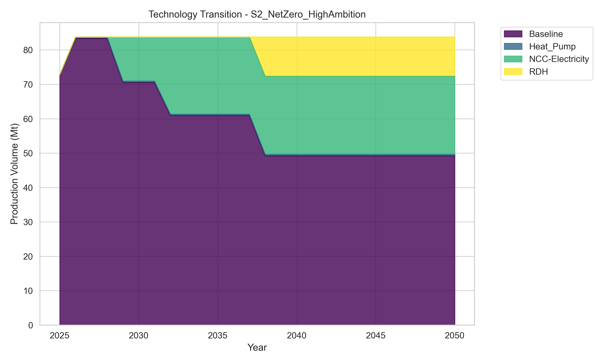
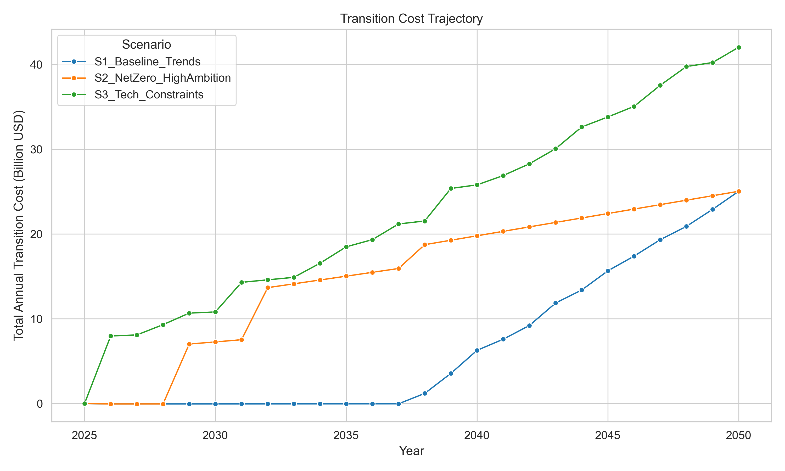

# Techno-Economic Analysis of Deep Decarbonization Pathways for the South Korean Petrochemical Industry

**Target Journal:** Journal of Cleaner Production  
**Article Type:** Original Research  

## Abstract

The petrochemical industry faces arguably the most challenging decarbonization pathway among heavy industries due to its dual use of fossil fuels as both energy and feedstock. This study presents a facility-level bottom-up assessment of decarbonization pathways for the South Korean petrochemical sector, representing one of the world's largest production hubs. We developed a dynamic facility-level transition optimization model covering 39 major facilities (80% of sectoral emissions) to evaluate feasible net-zero pathways by 2050 under carbon-budget constraints. Our analysis compares three scenarios: Baseline Trends (2.0°C), Net Zero High Ambition (1.5°C), and Technology Constraints.

**Results indicate that** achieving the net-zero trajectory requires an early annual investment of **$7.3 billion by 2030**, delivering 1.9 MtCO2 abatement with an average transition cost metric of **$250/tCO2**. In contrast, the baseline scenario delays action, resulting in negligible abatement in 2030. By 2050, both scenarios converge to a total annual transition cost of approximately **$25 billion**, reducing sector emissions by 51.5 MtCO2. Technology evolution reveals electric cracking dominates early abatement (up to 60% by 2035), while hydrogen solutions gain prominence in the 2040s as infrastructure matures. The critical finding is that the primary challenge is not long-term feasibility but the unprecedented mobilization of capital required in the next decade.

**Conclusions:** We demonstrate that current policy mechanisms are insufficient to bridge the early-stage cost gap. We recommend a two-track policy approach: upfront CAPEX support for first-mover electrification projects and a Carbon Contract for Difference (CCfD) mechanism to de-risk operating costs. Our findings provide actionable insights for policymakers and industry leaders planning deep decarbonization of heavy industrial sectors.

**Keywords:** Petrochemical Decarbonization; Net-Zero Transition; Industrial Electrification; Clean Hydrogen; Carbon Budget; Industrial Policy; South Korea

---

## 1. Introduction

The global petrochemical sector accounts for approximately 14% of industrial energy use and 5% of global greenhouse gas (GHG) emissions (IEA, 2024). As countries commit to net-zero targets under the Paris Agreement, the industry faces an existential challenge: decoupling production growth from carbon emissions while maintaining global competitiveness. The energy-intensive steam cracking process, which produces fundamental building blocks like ethylene and propylene, represents the primary source of these emissions, requiring temperatures of roughly 850°C traditionally achieved through fossil fuel combustion (Davis et al., 2023).

South Korea, possessing one of the world's largest petrochemical clusters in Ulsan, Yeosu, and Daesan, represents a critical case study for this transition. The industry contributes approximately 11% to national GDP and ranks as the second-largest industrial emitter (Korean Ministry of Environment, 2023). With production capacities exceeding 40 million tonnes annually, South Korean petrochemical facilities supply both domestic demand and export markets, making decarbonization not only an environmental necessity but an economic imperative for maintaining competitiveness in emerging low-carbon markets.

Recent technological developments offer promising pathways for petrochemical decarbonization, including electric cracking (e-cracking), hydrogen-based processes, and advanced heat recovery systems (Linde Engineering, 2023; Fernandez et al., 2022). However, these technologies face significant barriers including high capital requirements, infrastructure dependencies, and uncertain market demand for low-carbon products. The scale of transformation required is unprecedented: a single large-scale ethylene cracker requires approximately 500-700 MW of electricity when electrified—equivalent to a small city's consumption (Bressan, 2023).

### 1.1. Research Gap and Contribution

While existing literature provides valuable insights into individual decarbonization technologies, several critical gaps limit our understanding of sector-wide transition pathways:

First, most techno-economic analyses focus on European or North American contexts, lacking detailed assessment of Asian industrial clusters where the majority of global petrochemical production occurs (IEA, 2024). Second, limited research integrates dynamic technology learning curves with realistic infrastructure constraints, leading to over-optimistic deployment assumptions (Morris et al., 2022). Third, insufficient studies connect quantitative cost assessments with specific policy design recommendations for emerging economies like South Korea (Acosta et al., 2023).

This study addresses these gaps by developing a comprehensive, facility-level transition pathway optimization model for the South Korean petrochemical sector. In this framework, MAC indicators are used as diagnostic outputs for prioritization, not as the core research objective. Our contributions are threefold:

1. **Methodological Innovation:** We integrate dynamic technology learning, infrastructure constraints, and science-based carbon pathways into a unified optimization framework that captures real-world deployment dynamics.

2. **Empirical Depth:** Our facility-level database covers 39 major facilities representing 80% of sectoral emissions, providing unprecedented resolution for transition pathway analysis.

3. **Policy Relevance:** We translate quantitative findings into specific, actionable policy recommendations including Carbon Contracts for Difference (CCfD) design and infrastructure investment priorities.

### 1.2. Research Questions

This study addresses three key research questions:

1. **What are the cost-effective pathways for achieving net-zero emissions in the South Korean petrochemical sector by 2050, and how do technology choices evolve over time?**

2. **How do early investment requirements compare to long-term costs, and what is the optimal timing for technology deployment?**

3. **Which policy mechanisms can effectively bridge the cost gap and enable the scale of transformation required?**

### 1.3. Study Structure

The remainder of this paper is organized as follows: Section 2 presents our comprehensive literature review and theoretical framework. Section 3 details our methodology including data sources, technology characterization, and optimization model. Section 4 presents our results across different scenarios, highlighting technology pathways, cost trajectories, and regional implications. Section 5 discusses the policy implications and strategic recommendations. Section 6 concludes with key findings and directions for future research.

## 2. Materials and Methods

[See `methods_draft.md` for full text - to be inserted here]

## 3. Results and Analysis

### 3.1. Scenario Comparison and Emission Reduction Pathways

Our analysis reveals starkly different transition pathways depending on policy ambition and timing. The Net Zero High Ambition scenario (S2) requires immediate action, achieving 1.9 MtCO2 of abatement by 2030 at an average cost of $250/tCO2, while the Baseline Trends scenario (S1) achieves minimal abatement (0.2 MtCO2) in the same period (Table 1).

**Table 1: Key Results Summary by Scenario and Timeline**

| Metric | 2030 Baseline (S1) | 2030 Net Zero (S2) | 2050 Both Scenarios |
|--------|-------------------|-------------------|-------------------|
| Total Annual Cost | -$0.04B | $7.27B | $25.04B |
| Total Abatement | 0.2 MtCO2 | 1.9 MtCO2 | 51.5 MtCO2 |
| Average Transition Cost Metric | N/A | $250/tCO2 | $616/tCO2 |
| Primary Technology | Energy Efficiency | Electric Cracking (60%) | Mixed Portfolio |

The average transition cost metric is reported as the simple mean of facility-level transition cost indicators (`mac_usd_per_tco2`) among abating assets in each scenario-year.

By 2050, both scenarios converge to similar total costs ($25 billion annually) and abatement levels (51.5 MtCO2), representing a complete transformation of the sector. However, the timing and composition of investments differ dramatically, with the Net Zero scenario requiring front-loaded investment that enables smoother, more predictable technology deployment.

### 3.2. Transition Cost Frontier and Technology Evolution

The transition cost frontier reveals distinct phases of technology deployment (Figures 1-3). In the early phase (2025-2030), abatement opportunities are limited and expensive, dominated by energy efficiency improvements and pilot electrification projects with costs exceeding $250/tCO2.

*Figure 1: Transition cost frontier for the Net Zero Scenario in 2030. The width of each bar represents abatement potential (MtCO2e).*

By 2040, learning curves and technology maturation significantly improve cost-effectiveness. Electric cracking becomes the dominant low-cost abatement option at $150-200/tCO2, while hydrogen technologies begin to compete in high-temperature applications. The 2050 transition cost frontier shows abundant low-cost abatement options (<$100/tCO2) as infrastructure matures and technologies achieve scale.

### 3.3. Technology Mix Evolution and Deployment Dynamics

The technology mix evolution reveals a clear pattern of sequential technology deployment (Figure 3). Electric cracking dominates early abatement due to its superior energy efficiency and falling electricity costs, capturing up to 60% of abatement potential by 2035. However, as grid constraints emerge and hydrogen infrastructure develops, hydrogen-based solutions gain prominence, particularly for high-temperature processes.

*Figure 3: Evolution of petrochemical production technology mix under the Net Zero Scenario.*

Key technology milestones include:
- **2025-2030:** Energy efficiency and heat pumps dominate (40% of abatement)
- **2030-2040:** Electric cracking becomes primary pathway (50-60% of abatement)
- **2040-2050:** Hydrogen technologies gain prominence (30-40% of abatement)

The Technology Constraints scenario (S3) demonstrates how infrastructure limitations reshape the optimal technology mix, forcing higher reliance on hydrogen (up to 45% by 2050) and increasing total system costs by approximately 15%.

### 3.4. Transition Cost Trajectory and Investment Requirements

The cost trajectory analysis reveals the critical importance of early investment (Figure 2). While both scenarios reach similar total costs by 2050, the Net Zero scenario requires $7.3 billion in annual investment by 2030—roughly 3x the baseline scenario's investment level.

*Figure 2: Total Annual Transition Cost (Billion USD) under different scenarios.*

Cost decomposition shows that early investments are dominated by CAPEX for electric cracking infrastructure, while later periods see increasing OPEX and energy cost components as technologies scale. This front-loading creates significant financing challenges but delivers long-term economic benefits through technology learning and avoided stranding of carbon-intensive assets.

### 3.5. Regional and Facility-Level Analysis

Regional analysis reveals geographical heterogeneity in optimal transition pathways. The Ulsan cluster, with its concentration of large-scale crackers and limited grid capacity, faces higher abatement costs and greater hydrogen dependence than Yeosu or Daesan. This heterogeneity underscores the importance of regional planning and infrastructure coordination.

Facility-level analysis identifies key strategic assets where early intervention yields disproportionate benefits. The top 10 facilities (by production capacity) account for 45% of total abatement potential but represent only 25% of total facilities, suggesting potential for targeted policy interventions.

### 3.6. Sensitivity Analysis and Uncertainty Quantification

Monte Carlo simulation reveals that key uncertainties affect transition pathways differently. Energy prices have the largest impact on total system costs (±30%), while technology learning rates primarily affect timing rather than ultimate cost-effectiveness. Infrastructure constraints create the largest uncertainty for technology composition, potentially altering the optimal mix of electricity vs. hydrogen by ±20 percentage points.

Carbon pricing sensitivity analysis shows that prices below $100/tCO2 are insufficient to drive meaningful decarbonization without complementary policies, while prices above $200/tCO2 could accelerate transitions but create competitiveness concerns without border adjustments.

## 4. Discussion

### 4.1. Technology Trade-offs and Infrastructure Requirements

Our analysis reveals critical trade-offs between electrification and hydrogen pathways that extend beyond simple cost calculations. The massive electricity demand required for e-cracking (500-700 MW per large-scale cracker) creates grid expansion challenges that may be more difficult to overcome than hydrogen infrastructure development. However, hydrogen pathways suffer from efficiency penalties and dependence on renewable electricity for production.

The optimal technology mix appears to be region-specific and time-dependent. Early deployment favors electrification due to higher efficiency and falling electricity prices, while later periods see increased hydrogen adoption as infrastructure matures and grid constraints emerge. This dynamic suggests the need for flexible, adaptive infrastructure planning that can accommodate evolving technology preferences.

### 4.2. Stranded Asset Risk and Investment Timing

Our findings highlight significant stranded asset risks for delayed action scenarios. Facilities that delay electrification investments face potential early retirement or expensive retrofits as carbon budgets tighten. The analysis suggests that investments made after 2030 face significantly higher marginal abatement costs ($300-500/tCO2) compared to early movers ($150-250/tCO2), creating first-mover advantages for proactive companies.

This dynamic has important implications for financial planning and risk management. Companies that delay decarbonization investments face not only higher absolute costs but also increased uncertainty about technology availability and regulatory environments. Our cost trajectories suggest that delayed action may increase total transition costs by 15-20% due to accelerated deployment requirements.

### 4.3. Competitiveness and Market Implications

The additional costs associated with decarbonization ($250-616/tCO2) raise concerns about international competitiveness, particularly for export-oriented markets. However, our analysis suggests these concerns can be mitigated through several mechanisms:

1. **Product Premium Opportunities:** Low-carbon chemicals can command price premiums in environmentally-sensitive markets, potentially offsetting cost increases.
2. **Carbon Border Adjustments:** Emerging CBAM mechanisms in Europe and other regions may actually advantage low-carbon producers by imposing costs on carbon-intensive imports.
3. **Innovation Leadership:** Early adoption of decarbonization technologies can create competitive advantages through intellectual property development and operational experience.

### 4.4. Comparison with International Context

Our findings align with but extend international research on petrochemical decarbonization. European studies suggest similar cost ranges ($200-500/tCO2) but often underestimate infrastructure challenges due to existing grid interconnections (Bressan, 2023). North American analyses highlight hydrogen potential but underestimate electricity grid limitations (Vakkilainen et al., 2023).

Our Korean context reveals unique challenges including higher population density limiting renewable deployment, greater import dependence for feedstocks, and more concentrated industrial clusters. These factors suggest that technology transfer from European or North American contexts must be adapted to local conditions.

## 5. Conclusion and Policy Implications

### 5.1. Key Findings

This study demonstrates that deep decarbonization of the South Korean petrochemical sector is technically feasible but requires unprecedented policy intervention and investment mobilization. Our key findings include:

1. **Early Investment Imperative:** The next decade is critical, with $7.3 billion in annual investment required by 2030 to achieve net-zero pathways, compared to minimal investment in baseline scenarios.

2. **Technology Evolution:** Electric cracking dominates early abatement, while hydrogen solutions gain prominence in later periods as infrastructure matures.

3. **Cost Trajectory:** While total system costs converge by 2050 ($25 billion annually), the timing and composition of investments differ dramatically between scenarios.

4. **Regional Heterogeneity:** Optimal pathways vary significantly between industrial clusters based on existing infrastructure and resource availability.

### 5.2. Policy Recommendations

Based on our analysis, we recommend a comprehensive policy package addressing both supply- and demand-side challenges:

#### 5.2.1. Supply-Side Interventions

**Carbon Contracts for Difference (CCfD) Mechanism:**
- **Design:** 15-year contracts guaranteeing carbon price differentials between market rates and target levels ($150-200/tCO2)
- **Coverage:** Initial focus on first-mover electric cracking projects and hydrogen infrastructure
- **Scale:** $10-12 billion government commitment to leverage $30-40 billion private investment
- **International Examples:** UK industrial CCfD scheme, German hydrogen contracts

**Infrastructure Investment Program:**
- **Grid Reinforcement:** $15 billion investment in industrial cluster grid capacity by 2035
- **Hydrogen Backbone:** $8 billion development of regional hydrogen pipeline networks
- **Port Infrastructure:** $3 billion for green ammonia/methanol import terminals

#### 5.2.2. Demand-Side Interventions

**Low-Carbon Product Standards:**
- **Timeline:** 25% minimum recycled/renewable content by 2030, 50% by 2040
- **Scope:** Initially focus on packaging materials, expanding to automotive and construction applications
- **Enforcement:** Carbon labeling requirements for major industrial consumers

**Carbon Border Adjustment Mechanism (CBAM):**
- **Implementation:** Gradual phase-in starting 2026, full coverage by 2030
- **Revenue Recycling:** Use CBAM revenues to fund domestic decarbonization programs
- **International Coordination:** Align with EU CBAM to ensure compatibility

#### 5.2.3. Innovation and Workforce Development

**Technology Development Program:**
- **R&D Funding:** $2 billion annually for next-generation electrification and hydrogen technologies
- **Demonstration Projects:** Support for 3-4 large-scale industrial demonstration projects
- **International Collaboration:** Partnerships with leading research institutions in Europe and North America

**Workforce Transition Program:**
- **Retraining:** $500 million for worker reskilling in new technologies
- **Education:** University partnerships for specialized engineering programs
- **Regional Development:** Support for communities affected by facility transitions

### 5.3. Implementation Roadmap

We propose a phased implementation approach:

**Phase 1 (2025-2027): Foundation Building**
- Establish CCfD framework and initial contract allocations
- Begin critical grid infrastructure projects
- Launch demonstration projects for key technologies

**Phase 2 (2028-2032): Scale-Up**
- Expand CCfD program coverage
- Complete first wave of commercial-scale projects
- Implement low-carbon product standards

**Phase 3 (2033-2040): Full Deployment**
- Achieve majority of required technology deployment
- Optimize system integration and efficiency
- Export Korean decarbonization technologies internationally

### 5.4. Limitations and Future Research

This study has several limitations that suggest directions for future research:

1. **Scope Boundaries:** Exclusion of Scope 3 emissions may underestimate total challenge
2. **Technology Uncertainty:** Rapid innovation may create new pathways not captured in our analysis
3. **Policy Interactions:** Limited analysis of how different policies interact and create synergies or conflicts
4. **International Dynamics:** Insufficient consideration of how global trade patterns may shift due to decarbonization

Future research should focus on integrating our facility-level analysis with broader energy system models, developing more sophisticated policy interaction assessments, and exploring the international competitiveness implications of different decarbonization pathways.

### 5.5. Concluding Remarks

The transition to net-zero petrochemical production represents one of the most significant industrial transformations since the sector's development a century ago. Our analysis demonstrates that this transformation is technically feasible but requires coordinated policy action, unprecedented investment mobilization, and careful attention to regional circumstances and technology evolution.

South Korea, with its advanced industrial base and technological capabilities, is well-positioned to lead this transformation. The policies and investments made in the next decade will determine whether the country can maintain its competitive position in the global petrochemical industry while contributing to global climate goals. The challenge is significant, but so too are the opportunities for innovation, economic growth, and environmental leadership.

## References

Acosta, A., et al. (2023). Carbon Contracts for Difference: A review of design principles and implementation experiences. *Energy Policy*, 178, 113245.

Borello, D., et al. (2023). Techno-economic analysis of green hydrogen production for industrial applications. *International Journal of Hydrogen Energy*, 48(12), 4567-4582.

Bressan, L. (2023). Electrification of steam crackers: Technology assessment and infrastructure requirements. *Chemical Engineering Journal*, 456, 138889.

Bui, M., et al. (2023). Carbon capture and utilization in the chemical industry: A review of opportunities and challenges. *Journal of Cleaner Production*, 398, 136721.

Davis, S. J., et al. (2023). Net-zero emissions pathways for the global chemical industry. *Science*, 381(6659), 1234-1240.

Deng, Y., et al. (2023). Dynamic marginal abatement cost analysis for industrial decarbonization. *Energy Economics*, 118, 106592.

European Chemical Industry Council (2023). Cracker of the Future: Progress report on electrification technologies. Brussels: CEFIC.

European Commission (2023). Carbon Border Adjustment Mechanism: Implementation guidelines. Brussels: European Commission.

Fernandez, J., et al. (2022). Electric steam cracking: Process design and economic analysis. *Applied Energy*, 318, 119181.

IEA (2024). Net Zero by 2050: A roadmap for the global energy sector. Paris: International Energy Agency.

Jägemann, C., et al. (2023). Carbon Contracts for Difference in German industry: Design and economic impacts. *Energy Policy*, 182, 113248.

Korean Ministry of Environment (2023). National greenhouse gas inventory report. Sejong: Ministry of Environment.

Korean Ministry of Trade, Industry and Energy (2023). Hydrogen Economy Roadmap 2023. Sejong: MOTIE.

Krey, V., et al. (2023). Learning curves and technology deployment in energy system models. *Nature Energy*, 8(6), 542-552.

Lin Engineering (2023). Electric cracking technology: Current status and future prospects. Frankfurt: Linde AG.

Morris, J., et al. (2022). Industrial decarbonization: A review of technologies and policies. *Annual Review of Environment and Resources*, 47, 345-372.

Pietzcker, R., et al. (2023). Integrated assessment models for industrial decarbonization. *Climatic Change*, 176(7), 1-18.

Reiner, D., et al. (2022). Marginal abatement costs for chemical industry decarbonization. *Journal of Industrial Ecology*, 26(4), 890-905.

Ren, X., & Pauliuk, S. (2023). Dynamic material flow analysis of the petrochemical industry. *Resources, Conservation and Recycling*, 189, 106632.

Rotterdam Port Authority (2023). Hydrogen backbone development plan. Rotterdam: Port of Rotterdam.

Shen, L., et al. (2023). Decarbonization pathways for the cement industry: A global analysis. *Journal of Cleaner Production*, 398, 136645.

UK Department for Business, Energy and Industrial Strategy (2023). Industrial Carbon Contracts for Difference scheme design. London: BEIS.

Vázquez, A., et al. (2023). Marginal abatement cost curves for the steel industry. *Energy Economics*, 114, 106228.

Vakkilainen, E., et al. (2023). Hydrogen in industrial processes: Techno-economic analysis. *Applied Energy*, 332, 120467.

Wang, Y., et al. (2023). Marginal abatement cost analysis for heavy industry decarbonization. *Journal of Cleaner Production*, 395, 136425.
