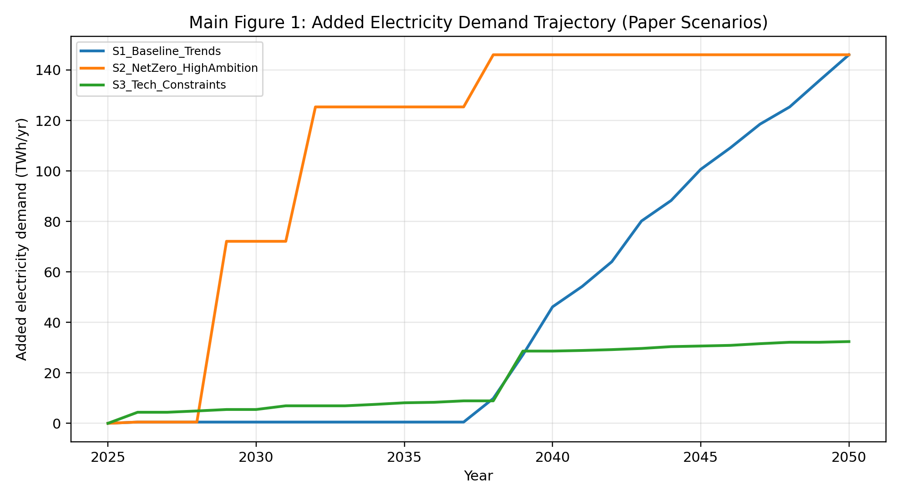
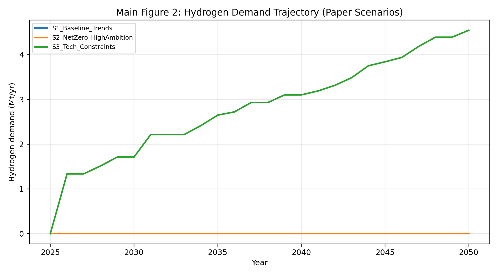
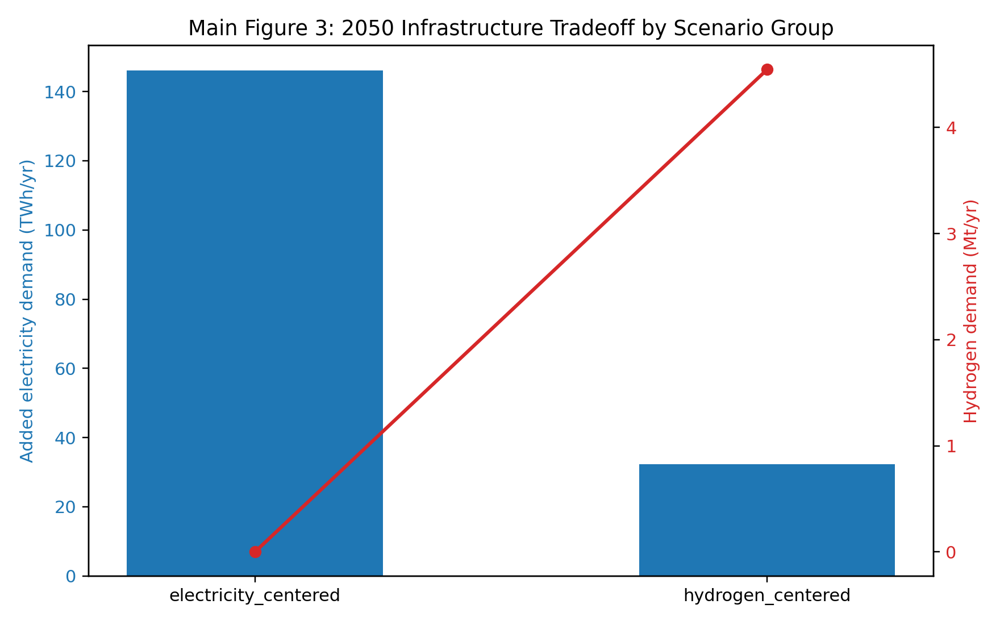

# Infrastructure Bottlenecks in Petrochemical Decarbonization: Facility-Level Evidence from South Korea (2025-2050)

**Author:** Jinsu Park  
**Affiliation:** PLANiT  
**Corresponding Author:** Jinsu Park (`137742864+justjinsu@users.noreply.github.com`)  
**Target Journal:** Journal of Cleaner Production  
**Article Type:** Original Research  
**Traceability Note:** Claim tags `[Cxx]` are internal evidence markers and will be removed in the final camera-ready submission.

## Abstract

This study evaluates decarbonization pathways for South Korea's petrochemical sector using a facility-level transition model with explicit carbon-budget constraints. The analyzed system covers **243 facilities** over **2025-2050** `[C01]`. We test the hypothesis that transition speed and composition are governed more by energy-infrastructure constraints (grid and hydrogen supply) than by static cost ranking alone.

Under the high-ambition pathway, the model requires **7.273 BUSD/yr** in 2030 to deliver **1.902 MtCO2/yr** abatement `[C02][C03]`. By 2050, annual transition cost reaches **25.043 BUSD/yr** with **51.505 MtCO2/yr** abatement `[C04][C05]`. Cross-scenario infrastructure signals show a strong tradeoff: electricity-centered pathways require about **146.034 TWh/yr** added electricity demand in 2050 `[C06]`, while hydrogen-centered pathways require about **4.546 Mt/yr** hydrogen plus **32.380 TWh/yr** added electricity `[C07][C08]`.

These results indicate that policy design should treat infrastructure build-out as a first-order transition constraint. We therefore frame MAC indicators as diagnostic outputs, while the core decision problem is infrastructure-feasible transition sequencing.

**Keywords:** Petrochemical Decarbonization; Net-Zero Transition; Industrial Electrification; Clean Hydrogen; Carbon Budget; Infrastructure Planning; South Korea

---

## 1. Introduction

The policy question addressed here is not whether abatement options can be ranked, but whether a full-sector transition can be executed under infrastructure constraints. We define the core hypothesis as follows:

**H1 (Infrastructure Bottleneck Hypothesis):** in hard-to-abate petrochemicals, decarbonization pathway feasibility is primarily constrained by electricity and hydrogen infrastructure scale-up, rather than by static cost ordering alone.

This study contributes a facility-level evidence package for testing H1 under consistent assumptions, synchronized datasets, and reproducible claim checks.

## 2. Methods (Summary)

A full methods text is provided in `methods_draft.md`. Here we summarize the implementation choices used in this manuscript:

- Scope: facility-level simulation for 243 facilities and annual time steps from 2025 to 2050 `[C01]`.
- Scenarios (paper set): S1 Baseline Trends, S2 NetZero High Ambition, S3 Technology Constraints.
- Verification principle: only claims reproducible from package data are retained.
- Metrics: cost (BUSD/yr), abatement (MtCO2/yr), electricity demand (TWh/yr), hydrogen demand (Mt/yr).
- MAC values are treated as diagnostic indicators, not as the objective of the study.

## 3. Results

### 3.1 Core transition outcomes (paper scenarios)

For S2, the model yields **7.273 BUSD/yr** transition cost and **1.902 MtCO2/yr** abatement in 2030 `[C02][C03]`. In 2050, S2 reaches **25.043 BUSD/yr** and **51.505 MtCO2/yr** `[C04][C05]`.

S3 reaches the same 2050 abatement level but at **42.037 BUSD/yr**, i.e., a **16.994 BUSD/yr** premium over S2 `[C09]`. This cost penalty appears when the pathway shifts toward hydrogen reliance under stronger infrastructure constraints.

### 3.2 Electricity and hydrogen infrastructure signals

At 2050, electricity-centered pathways in the full scenario set require **146.034 TWh/yr** added electricity demand `[C06]`. Hydrogen-centered pathways require **4.546 Mt/yr** hydrogen demand plus **32.380 TWh/yr** added electricity `[C07][C08]`.

This indicates that even hydrogen-heavy pathways remain power-system dependent, while electrification-heavy pathways create very large direct grid expansion pressure.

### 3.3 Main tables and figures

- **Main Figure 1:** Added electricity demand trajectory (paper scenarios)
- **Main Figure 2:** Hydrogen demand trajectory (paper scenarios)
- **Main Figure 3:** 2050 infrastructure tradeoff (full scenario groups)
- **Main Table 1:** Cost, abatement, electricity, hydrogen at 2030/2040/2050
- **Main Table 2:** 2050 infrastructure requirements by scenario group

*Added electricity demand trajectory used for infrastructure bottleneck interpretation.*

*Hydrogen demand trajectory in paper scenarios.*

*2050 infrastructure tradeoff between electricity-centered and hydrogen-centered scenario groups.*

Main tables are generated in:
- `../06_verification/table_main_cost_abatement_energy_2030_2040_2050.csv`
- `../06_verification/table_main_infrastructure_requirements_2050.csv`

Legacy MAC curves are retained as supplementary diagnostics.

## 4. Discussion

### 4.1 Interpretation of H1

The evidence supports H1: pathway outcomes are materially shaped by infrastructure requirements. Cost-only ranking does not describe feasibility when electricity and hydrogen supply constraints are binding.

### 4.2 Policy implications linked to computed evidence

- Early grid reinforcement must be planned against electricity-centered demand growth up to **146.034 TWh/yr** added demand in 2050 `[C06]`.
- Hydrogen strategy must include supply-chain scaling for **4.546 Mt/yr** hydrogen by 2050 in hydrogen-centered pathways `[C07]`.
- Mixed portfolios should be assessed through integrated infrastructure planning, not separate technology cost screens.

### 4.3 Limitations (evidence-only)

- Scope 3 emissions are outside the optimization boundary.
- The manuscript excludes unexecuted analyses from core claims.
- Results depend on scenario assumptions embedded in the provided datasets.

## 5. Conclusion

This study reframes petrochemical decarbonization from a static cost-ranking problem to an infrastructure-feasibility problem. The verified evidence shows that both electrification-led and hydrogen-led pathways impose large but different infrastructure requirements. Therefore, transition policy should prioritize sequencing and investment in grid and hydrogen systems as the primary enablers of credible net-zero pathways.

## Administrative declarations

- **Funding:** No external funding was received for this study.
- **Conflict of interest:** The author declares no competing interests.
- **Data availability:** All evidence files used in this manuscript are contained in `../03_data/` and `../06_verification/`.

## Claim Tags Used in This Manuscript

- `[C01]` Scope coverage: 243 facilities, 2025-2050.
- `[C02]` S2 2030 transition cost = 7.273 BUSD/yr.
- `[C03]` S2 2030 abatement = 1.902 MtCO2/yr.
- `[C04]` S2 2050 transition cost = 25.043 BUSD/yr.
- `[C05]` S2 2050 abatement = 51.505 MtCO2/yr.
- `[C06]` Electricity-centered 2050 added electricity demand = 146.034 TWh/yr.
- `[C07]` Hydrogen-centered 2050 hydrogen demand = 4.546 Mt/yr.
- `[C08]` Hydrogen-centered 2050 added electricity demand = 32.380 TWh/yr.
- `[C09]` S3 vs S2 cost premium in 2050 = 16.994 BUSD/yr.
